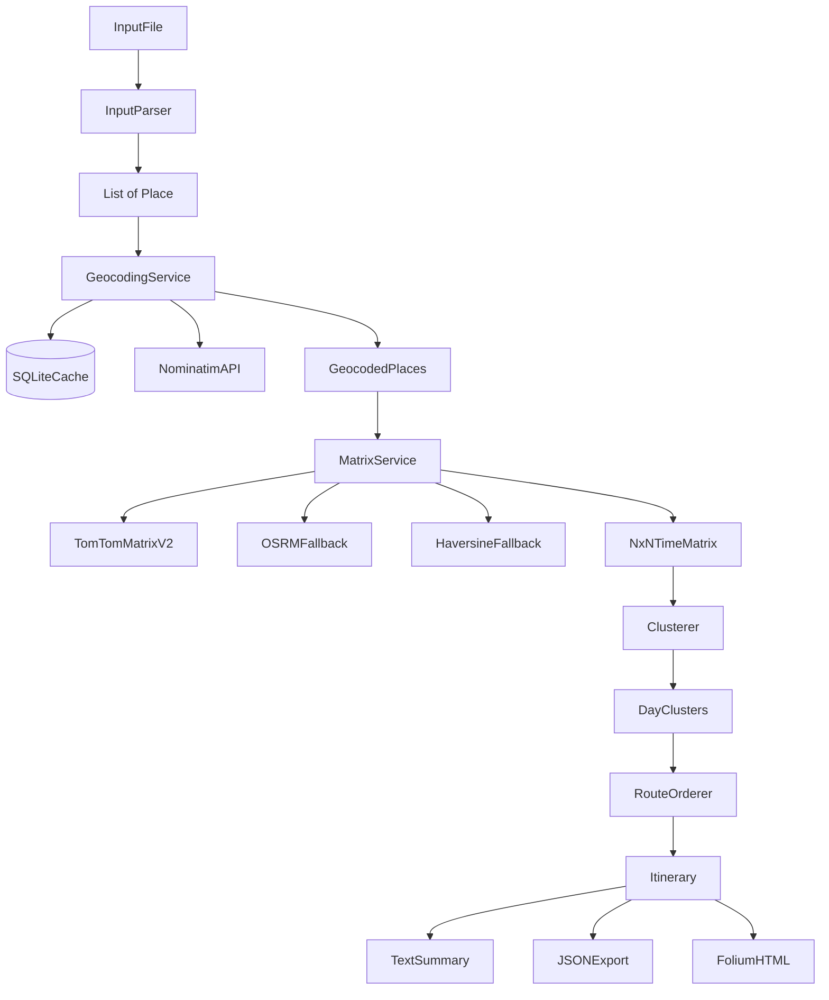
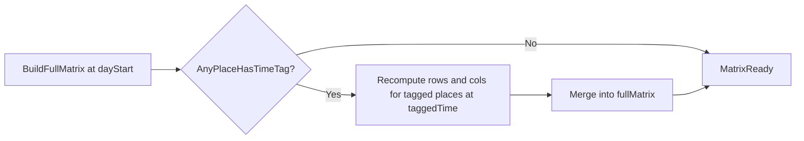
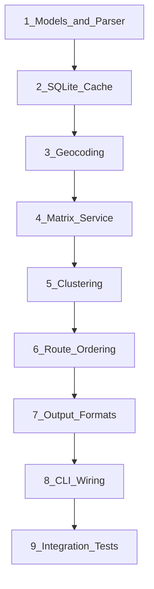

# TripCluster Technical Design Plan

## Executive Summary

TripCluster is a Python CLI that turns a plain-text list of tourist locations into a multi-day itinerary. Places are geocoded, pairwise travel times are fetched from TomTom's Matrix Routing v2 API with live/historical traffic (with OSRM and haversine fallbacks), grouped into `--days` clusters using matrix-based clustering, ordered within each day via a TSP heuristic, and exported as CLI text, JSON, and a folium HTML map.

**Confirmed design decisions:**
- **Geographic context:** optional first-line header in the input file (e.g., `# region: Bay Area, CA`)
- **Routing API:** TomTom Matrix Routing v2 (free tier, traffic-aware) as primary; OSRM public server + haversine as fallbacks
- **Geocoding:** Nominatim (free, no API key)
- **Failed geocodes:** abort the run by default; optional `--skip-failures` for lenient mode
- **Route shape:** open path (no return-to-start loop)
- **Day start:** `--day-start` defaults to `09:00`
- **Time tags:** soft preference (optimize toward tagged time, not a hard constraint)
- **Duplicates:** deduplicate exact duplicate place lines (keep first occurrence, warn on stderr)
- **`--max-per-day`:** optional, unlimited by default

---

## Proposed Folder / File Structure

```
trip_cluster/
├── pyproject.toml              # project metadata, deps, CLI entry point
├── README.md                   # setup, API usage policy, examples
├── .env.example                # TOMTOM_API_KEY, NOMINATIM_USER_AGENT
├── .gitignore
│
├── src/trip_cluster/
│   ├── __init__.py
│   ├── __main__.py             # python -m trip_cluster
│   ├── cli.py                  # Typer app: flags, orchestration
│   ├── config.py               # env vars, defaults, rate-limit settings
│   ├── models.py               # Place, GeocodedPlace, DayPlan, Itinerary
│   ├── exceptions.py           # GeocodeError, MatrixError, etc.
│   │
│   ├── input/
│   │   ├── __init__.py
│   │   └── parser.py           # read file, parse @HH:MM tags, region header
│   │
│   ├── geocoding/
│   │   ├── __init__.py
│   │   ├── base.py             # Geocoder protocol / ABC
│   │   ├── nominatim.py        # Nominatim client (primary)
│   │   └── service.py          # cache-aware geocode orchestration
│   │
│   ├── matrix/
│   │   ├── __init__.py
│   │   ├── base.py             # MatrixProvider protocol
│   │   ├── tomtom.py           # TomTom Matrix Routing v2 (primary, traffic-aware)
│   │   ├── osrm.py             # OSRM Table API (fallback, no traffic)
│   │   ├── haversine.py        # straight-line fallback + speed heuristic
│   │   └── service.py          # cache, symmetrization, tagged-time overrides
│   │
│   ├── clustering/
│   │   ├── __init__.py
│   │   └── clusterer.py        # agglomerative + optional k-medoids
│   │
│   ├── routing/
│   │   ├── __init__.py
│   │   └── ordering.py         # nearest-neighbor + 2-opt + time anchors
│   │
│   ├── output/
│   │   ├── __init__.py
│   │   ├── text.py             # CLI summary
│   │   ├── json_export.py
│   │   └── map_html.py         # folium map
│   │
│   └── cache/
│       ├── __init__.py
│       └── sqlite.py           # shared SQLite cache layer
│
├── tests/
│   ├── conftest.py             # fixtures, mock matrix/places
│   ├── fixtures/
│   │   ├── sample_input.txt
│   │   └── mock_matrix.json
│   ├── unit/
│   │   ├── test_parser.py
│   │   ├── test_clustering.py
│   │   ├── test_ordering.py
│   │   └── test_haversine.py
│   └── integration/
│       └── test_pipeline.py    # full pipeline, all APIs mocked
│
└── examples/
    └── bay_area_sample.txt
```

**CLI entry point** (in `pyproject.toml`):
```toml
[project.scripts]
trip-cluster = "trip_cluster.cli:app"
```

---

## External API Recommendations

### Chosen Stack

| Layer | Primary | Fallback | Cost |
|-------|---------|----------|------|
| Geocoding | [Nominatim](https://nominatim.org/) (OSM) | — | Free; 1 req/sec policy |
| Routing matrix | [TomTom Matrix Routing v2](https://developer.tomtom.com/matrix-routing-v2-api/documentation/product-information/introduction) | [OSRM Table API](http://project-osrm.org/) → haversine | Free tier: 2,500 non-tile transactions/day |
| Ultimate fallback | Haversine distance ÷ assumed speed | — | Local, no network |

### Why TomTom for v1

TomTom's free developer tier (no credit card) includes **2,500 non-tile API transactions per day** and access to **Matrix Routing v2** with:
- `traffic: "live"` — real-time traffic for departure times near now
- `traffic: "historical"` — time-of-day traffic patterns for future `departAt` values
- `departAt: <RFC3339 datetime>` — departure-time-aware routing (supports `@time` overrides)
- Asymmetric travel times (A→B ≠ B→A) returned natively
- Synchronous matrix up to **100 origins × 100 destinations** (10,000 cells) on free tier — more than enough for personal trip planning (typical N ≤ 20)

**Personal-use budget example:** 15 places → one 15×15 sync matrix request. With SQLite caching, reruns cost zero API calls. Tagged-time overrides re-fetch only rows/cols for tagged places (at most `2 × N × k` extra edge batches for k tagged places).

**Required setup:** Free API key via [TomTom Developer Portal](https://developer.tomtom.com/) → `TOMTOM_API_KEY` env var.

### Tradeoffs vs Alternatives

| Option | Traffic-aware? | Free tier | Matrix support | Notes |
|--------|----------------|-----------|----------------|-------|
| **TomTom Matrix v2 (chosen)** | Yes (`live` + `historical`) | 2,500 txn/day | Sync ≤100×100 | Best fit for requirements; needs API key |
| **OSRM (fallback)** | No | Public demo server | Yes (`/table`) | Good offline-style fallback; cache aggressively |
| **OpenRouteService** | No (free tier) | 500 matrix req/day | Yes | Removed from v1 cascade; can add later |
| **Google Distance Matrix** | Yes | ~$200/mo credit | Yes | Best accuracy but paid beyond hobby scale |
| **Mapbox Matrix** | Limited on free | 100k coords/mo | Yes (≤25 coords/request) | Requires chunking for large N |

**Provider cascade:**
1. TomTom Matrix v2 (live traffic for near-term dates, historical for future trip dates)
2. OSRM `/table` (if TomTom fails, rate-limits, or key missing)
3. Haversine with assumed urban speed (40 kph default)

Design remains behind a `MatrixProvider` protocol so providers can be swapped without touching clustering/routing.

### TomTom-Specific Design Choices

| Setting | Default matrix | Tagged-place override |
|---------|----------------|----------------------|
| `traffic` | `"live"` if trip date is today; `"historical"` if future date | Same rule, using tagged time |
| `departAt` | `{trip_date}T{day_start}` (e.g., `2026-07-15T09:00:00`) | `{trip_date}T{tagged_time}` |
| `travelMode` | `"car"` | `"car"` |
| `routeType` | `"fastest"` | `"fastest"` |

**Trip date:** New optional `--trip-date YYYY-MM-DD` flag (default: today in local timezone). Combined with `--day-start` and `@time` tags to build RFC 3339 `departAt` values TomTom requires.

### API Usage Notes

- **Nominatim** requires a descriptive `User-Agent` (configurable via env). Respect 1 req/sec; the geocoding service will throttle.
- **TomTom** returns `429` when daily quota exceeded → fall back to OSRM for that request, cache result with `source=tomtom|osrm|haversine`.
- **OSRM public server** is not SLA-backed; acceptable for personal use with caching as fallback only.
- **Region header** is passed to Nominatim as query context (appended as `"{name}, {region}"`).

### Realistic Cost for Personal Use

For 15 places on first run: 15 geocode calls + 1 TomTom matrix call ≈ ~16 non-tile transactions. Well within 2,500/day. SQLite cache makes reruns nearly free.

---

## Architecture Overview



---

## Module Design Decisions

### 1. Input Parser (`src/trip_cluster/input/parser.py`)

**Responsibilities:**
- Read `--input` file, one place per line
- Parse optional header: `# region: Bay Area, CA` (case-insensitive key)
- Parse inline time tags: `Mt. Tam @ 6:00am`, `Lunch @ 12:30 PM` (flexible 12h/24h)
- Strip comments (`# ...`) on non-header lines
- **Deduplicate** exact duplicate lines (normalized name + time tag): keep first occurrence, emit warning on stderr for each skipped duplicate

**Deduplication rules:**
- Key = `(normalized_name.lower().strip(), fixed_time)` — same name with different time tags are kept as separate entries
- First occurrence wins; later duplicates are dropped with a warning like: `Skipping duplicate on line 7: "Golden Gate Park"`

**Key model** (`src/trip_cluster/models.py`):
```python
@dataclass
class Place:
    raw_name: str          # "Mt. Tam"
    fixed_time: time | None  # parsed from @tag
    line_number: int
```

**Tradeoff:** Header-based region is simple and explicit vs a `--region` CLI flag. Header keeps all trip context in one file; we can add `--region` later as override.

---

### 2. Geocoding Module

**Flow:**
1. Check SQLite cache by `(normalized_name, region)` key
2. On miss: call Nominatim with `q="{name}, {region}"` when region present
3. Store `(lat, lng, formatted_address, place_id, confidence)` in cache
4. On failure: **abort the entire run** by default (raise `GeocodeError`, exit code 1)

**Failure handling:**

| Failure | Behavior (default) | With `--skip-failures` |
|---------|---------------------|------------------------|
| Zero results | Abort with clear error | Warn, exclude place from matrix |
| Multiple results | Pick highest `importance` score; warn if top-2 are close | Same |
| Rate limit / timeout | Retry with backoff (3 attempts), then abort | Retry, then exclude place |
| Network error | Retry, then abort | Retry, then exclude place |

**Tradeoff:** Fail-fast default ensures the itinerary is built on complete, trusted data. `--skip-failures` opt-in supports exploratory runs with messy input.

**Cache schema** (`geocode_cache` table):
- `cache_key TEXT PRIMARY KEY` — normalized name + region
- `lat, lng, formatted_address, osm_id, fetched_at`

---

### 3. Distance Matrix Module

**Matrix semantics:**
- `matrix[i][j]` = driving travel time in **seconds** from place i → place j
- **Asymmetric** matrix preserved for routing/TSP
- **Symmetrized** copy `(d_ij + d_ji) / 2` used only for clustering (sklearn requires symmetric precomputed distances)

**Default departure time:** `{trip_date}T{day_start}` (e.g., `2026-07-15T09:00:00`). TomTom uses this for `departAt` with `traffic: "live"` (today) or `"historical"` (future dates).

**Tagged-time override behavior:**



For each tagged place `T` at time `t_T`:
- Re-fetch all edges `T → *` and `* → T` via TomTom with `departAt: {trip_date}T{t_T}` and appropriate `traffic` mode
- Untagged edges remain at default `day_start` departure
- With TomTom, these overrides produce **meaningfully different** travel times (rush hour vs off-peak)

**Provider cascade per matrix batch:**
1. SQLite cache hit → use cached
2. **TomTom** synchronous matrix POST (`/routing/matrix/2`) — full N×N in one call
3. **OSRM** `/table/v1/driving/{coords}` (if TomTom fails, 429 quota, or `TOMTOM_API_KEY` missing)
4. **Haversine:** `time = distance_km / ASSUMED_SPEED_KPH * 3600` (default 40 kph urban)

**TomTom request shape (v1):**
```json
{
  "origins": [{"point": {"latitude": 37.77, "longitude": -122.42}}, ...],
  "destinations": [{"point": {"latitude": 37.77, "longitude": -122.42}}, ...],
  "options": {
    "departAt": "2026-07-15T09:00:00",
    "routeType": "fastest",
    "traffic": "historical",
    "travelMode": "car"
  }
}
```

Response `travelTimeInSeconds` per cell → `matrix[i][j]`. Diagonal (same origin/dest) = 0.

**Cache schema** (`matrix_cache` table):
- `origin_id, dest_id, departure_bucket TEXT` (e.g., `2026-07-15T09:00`)
- `duration_seconds REAL, source TEXT` (tomtom | osrm | haversine)
- `fetched_at`

**Tradeoff — batch vs per-edge:** TomTom and OSRM both return full N×N in one request (efficient). Tagged overrides re-request sub-matrices involving tagged indices only (at most `2 × N × k` extra batches for k tagged places).

---

### 4. Clustering Module

**Algorithm choice: Agglomerative Clustering (average linkage) as primary**

| Criterion | Agglomerative (average) | K-Medoids (PAM) |
|-----------|-------------------------|-----------------|
| sklearn support | Built-in, `metric='precomputed'` | Requires `scikit-learn-extra` (less maintained) |
| Fixed k clusters | `n_clusters=--days` | `n_clusters=--days` |
| Cluster center | None (just partition) | Actual place (medoid) — nice for UX |
| Handles asymmetric input | Via symmetrization | Via symmetrization |
| Determinism | Deterministic | Depends on init |

**Decision:** Implement **AgglomerativeClustering** as v1 default (reliable, zero extra deps). Add optional **k-medoids** behind a `--cluster-method medoids` flag if medoid interpretability is desired later.

**`--days` not provided — auto-suggest:**
- Default heuristic: `ceil(n_places / 5)` (assume ~5 attractions/day)
- Print suggestion to stderr: `"No --days given; using 3 days for 14 places"`
- Future enhancement: elbow method on merge distances (not v1)

**Max attractions per day:**
- Optional `--max-per-day <N>` flag (default: unlimited)
- Enforcement: post-cluster **split** pass — if any cluster exceeds max, move furthest-from-centroid place to next-nearest cluster (iterate until valid or warn)

**Edge cases:**
- `n_places < days`: assign one place per day, leave empty days
- `n_places == 1`: single day, trivial order
- With `--skip-failures`: failed geocodes reduce effective N

---

### 5. Route Ordering Module

**Problem:** Per-day open-path TSP on typically 3–8 nodes — heuristic is sufficient. Routes do **not** return to a start/hotel (open path, per your preference).

**Algorithm (v1):**
1. **Anchor timed places** — sort by `fixed_time`, treat as soft sequence guides (not hard locks)
2. **Nearest-neighbor construction** starting from the place closest to day centroid (or first untimed stop after day-start)
3. **2-opt improvement** — swap edges until no improvement (max 100 iterations), optimizing total driving time
4. **Timed-place insertion** — if timed places exist, partition the day into segments between anchors; run NN+2-opt within each segment

**Time constraint handling (soft preference):**
- `--day-start` defaults to `09:00`; combined with `--trip-date` for schedule simulation
- Simulate forward: `arrival_time = prev_departure + matrix[prev][next]`
- After 2-opt, score each order by `total_drive_time + λ × time_deviation_penalty` where penalty = abs(arrival − tagged_time) for tagged places (λ tuned so 30 min deviation ≈ 10 min drive time)
- Run limited local swaps if timed-place deviation exceeds 30 min
- Report estimated arrival vs tagged time in text output (e.g., `arr ~06:12 (tagged 06:00)`)

**Tradeoff:** Soft preferences keep the optimizer flexible — a tagged sunrise spot won't force a 4am start for distant places if the drive cost is too high. Hard constraints deferred to v2.

**Day travel time metric:** Sum of `matrix[order[i]][order[i+1]]` along the ordered open path (asymmetric edges used as-is; no return leg).

---

### 6. Output Module

**CLI text summary:**
```
TripCluster Itinerary — 3 days, 12 places
Region: Bay Area, CA

Day 1 (4 places, ~47 min driving):
  1. Golden Gate Park       arr ~09:00
  2. Lands End              (+12 min)
  3. Baker Beach            (+8 min)
  4. Sutro Baths            (+15 min)

Day 2 ...
```

(No geocode warnings in default mode — run aborts instead. Warnings appear only with `--skip-failures`.)

**JSON export** (`--output-json`):
```json
{
  "region": "Bay Area, CA",
  "days": [
    {
      "day": 1,
      "places": [
        {"name": "...", "lat": 37.7, "lng": -122.4, "arrival_estimate": "09:00", "fixed_time": null}
      ],
      "total_travel_seconds": 2820,
      "route_order": [0, 3, 1, 2]
    }
  ],
  "warnings": [],
  "matrix_source": "tomtom"
}
```

**HTML map** (`--output-map`):
- Single folium `Map` centered on centroid of all places
- `FeatureGroup` per day with distinct color from a fixed palette
- Markers: popup with name, day number, order index
- Optional polyline per day connecting stops in route order
- Standalone HTML, no server needed

---

### 7. Testing Strategy

| Test file | Scope | API calls |
|-----------|-------|-----------|
| `test_parser.py` | Region header, time tags, deduplication, edge cases | None |
| `test_clustering.py` | Valid partitions, `--days`, `--max-per-day` | None |
| `test_ordering.py` | NN + 2-opt improves cost; timed anchors | None |
| `test_haversine.py` | Fallback math | None |
| `test_pipeline.py` | End-to-end with mocked geocoder + matrix provider | None (mocked) |

**Mocking approach:** Define `Geocoder` and `MatrixProvider` protocols; inject fakes in tests. Store a 5-node asymmetric matrix in `fixtures/mock_matrix.json`.

**Clustering test assertions:**
- Exactly `--days` non-empty clusters (or fewer if n < days)
- Every place assigned exactly once
- `--max-per-day` respected after split pass

**Integration test:** `examples/bay_area_sample.txt` → mocked providers → verify JSON schema, 3 days, ordered routes.

---

## Dependency List

```toml
# pyproject.toml [project.dependencies]
typer[all]>=0.12          # CLI
httpx>=0.27               # async-capable HTTP for APIs
folium>=0.16              # HTML maps
scikit-learn>=1.4         # AgglomerativeClustering
numpy>=1.26               # matrix operations
python-dateutil>=2.9      # flexible time parsing

# [project.optional-dependencies]
medoids = ["scikit-learn-extra>=0.3"]  # optional k-medoids

# [project.optional-dependencies.dev]
dev = ["pytest>=8.0", "pytest-cov>=5.0", "ruff>=0.4"]
```

**Stdlib:** `sqlite3`, `dataclasses`, `json`, `re`, `pathlib`, `logging`

---

## Suggested Build Order



| Step | Module | Why this order |
|------|--------|----------------|
| 1 | `models.py` + `input/parser.py` + parser tests | Pure logic, no network; defines all downstream types |
| 2 | `cache/sqlite.py` | Shared infrastructure needed by geocoding + matrix |
| 3 | `geocoding/` | Places must exist before matrix; testable with recorded HTTP fixtures |
| 4 | `matrix/` | Core differentiator; clustering/routing depend on it |
| 5 | `clustering/` | Testable with synthetic matrices once step 4's test fixtures exist |
| 6 | `routing/ordering.py` | Needs cluster output + asymmetric matrix |
| 7 | `output/` | Consumes final `Itinerary` model |
| 8 | `cli.py` | Thin orchestration layer wiring all modules |
| 9 | Integration test | Validates full pipeline last |

**Per-module delivery:** Each step ships with unit tests before moving on (module-by-module).

---

## Implementation Checklist

- [ ] **1.** `models.py` + `input/parser.py` (region header, `@time` tags) with parser unit tests
- [ ] **2.** `cache/sqlite.py` with geocode and matrix cache schemas
- [ ] **3.** Nominatim geocoder + cache-aware service with failure handling
- [ ] **4.** TomTom Matrix v2 (live traffic) + OSRM/haversine fallbacks with tagged-time overrides and caching
- [ ] **5.** Agglomerative clustering with symmetrized matrix, `--days`, `--max-per-day` split pass
- [ ] **6.** Nearest-neighbor + 2-opt ordering with timed-place anchors
- [ ] **7.** Text summary, JSON export, and folium HTML map
- [ ] **8.** Typer CLI and end-to-end orchestration in `cli.py`
- [ ] **9.** Full pipeline integration test with mocked geocoder and matrix providers

---

## CLI Interface (Final)

```
trip-cluster --input places.txt --days 3 \
  --output-map itinerary.html \
  --output-json itinerary.json \
  [--max-per-day 6] \
  [--day-start 09:00] \
  [--trip-date 2026-07-15] \
  [--cache-db ~/.tripcluster/cache.db] \
  [--skip-failures] \
  [--cluster-method agglomerative]
```

| Flag | Required | Default |
|------|----------|---------|
| `--input` | Yes | — |
| `--days` | No | auto: `ceil(n/5)` |
| `--output-map` | No | no map generated |
| `--output-json` | No | no JSON generated |
| `--max-per-day` | No | unlimited |
| `--day-start` | No | `09:00` |
| `--trip-date` | No | today (local timezone) |
| `--skip-failures` | No | off (abort on geocode failure) |
| `--cache-db` | No | `~/.tripcluster/cache.db` |

**Environment variables:**

| Variable | Required | Purpose |
|----------|----------|---------|
| `TOMTOM_API_KEY` | Yes (for traffic matrix) | TomTom Matrix Routing v2 |
| `NOMINATIM_USER_AGENT` | Recommended | Nominatim usage policy compliance |

---

## Resolved Decisions

| # | Question | Decision |
|---|----------|----------|
| 1 | Traffic-aware routing | **TomTom Matrix v2** free tier (`live` + `historical` traffic); OSRM/haversine fallbacks |
| 2 | `--max-per-day` | Optional flag, **unlimited by default** |
| 3 | Failed geocodes | **Abort by default**; `--skip-failures` for lenient mode |
| 4 | Route shape | **Open path** (no return-to-start) |
| 5 | Day start time | **`--day-start` defaults to `09:00`** |
| 6 | OSRM reliability | **Personal use with caching** as fallback when TomTom unavailable |
| 7 | `@time` tag semantics | **Soft preference** — optimize toward tagged time, report deviation |
| 8 | Duplicate places | **Deduplicate** — keep first occurrence, warn on skipped duplicates |

**Minor default:** All datetime values (`--trip-date`, `--day-start`, `@time` tags) use the **local system timezone** unless a future `--timezone` flag is added.

---

## Key Risks and Mitigations

| Risk | Mitigation |
|------|------------|
| TomTom daily quota exceeded (2,500 txn/day) | SQLite cache; fall back to OSRM; warn when serving cached/fallback data |
| TomTom API key missing | Fall back to OSRM + warn; document key setup in README |
| OSRM public server downtime | Haversine fallback + aggressive cache |
| Nominatim rate limits | 1 req/sec throttle, cache, batch reruns are free |
| Asymmetric matrix + sklearn | Symmetrize only for clustering; keep raw for routing |
| Clustering with very small N | Guard rails for edge cases (n < days, n == 1) |
| Soft time tags vs drive cost | Penalty-weighted scoring; report deviation in output so user can judge |

---

## Next Steps

Implementation proceeds **module by module** in the build order above. Each module gets:
1. Implementation
2. Unit tests
3. Review before proceeding to the next module

**Prerequisite before module 4 (matrix):** Sign up for a free TomTom API key and set `TOMTOM_API_KEY` in `.env`.
